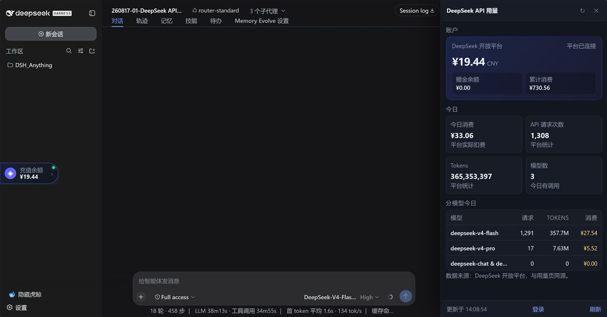

# dsh-deepseek-usage

DeepSeek API 用量监测插件：右侧悬浮球显示充值余额，点击展开面板展示累计消费、今日消费、API 请求次数、Tokens 和分模型今日用量，并实时计算 8 月 17 日后的实际涨价倍率 R0（A2/A1）。



## 数据来源

全部数据来自 DeepSeek 开放平台私有 API，与官方用量页同源：

- `GET /api/v0/users/get_user_summary` — 充值余额、赠金余额、累计消费
- `GET /api/v0/usage/by_api_key/amount` — 今日请求次数 / Tokens
- `GET /api/v0/usage/by_api_key/cost` — 今日消费 / 分模型消费

**不使用本地价格表，不估算，不计算消费。**

## 配置

`userToken` 是平台 Web 登录态，只作为配置项，不写入插件源码/包内。

在 profile 的 `cordis.patch.yml` 中配置：

```yaml
- id: deepseek-usage
  config:
    platformUserToken: '你的 userToken'
```

也可以设置环境变量：

```sh
DEEPSEEK_PLATFORM_USER_TOKEN=你的 userToken
```

获取方式：登录 `https://platform.deepseek.com/usage` → F12 → Application → Local Storage → `https://platform.deepseek.com` → `userToken` → 复制 JSON 里的 `value` 字段。

也可以不手动配置：点击面板中的 **「登录」** 按钮，插件会打开本地 Edge 窗口让你登录 DeepSeek 开放平台，登录成功后自动读取并保存 `userToken`。

## 路由

- `GET /api/deepseek-usage/state` — 当前余额 + 今日用量快照。
- `POST /api/deepseek-usage/refresh` — 强制刷新。

路由仅限 loopback，响应 `Cache-Control: no-store`。

## 开发

```sh
pnpm install
pnpm build        # host tsc + client tsdown
pnpm typecheck
pnpm verify
```
